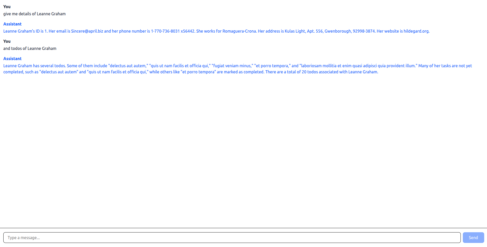

# TanStack AI Demo Project

This project is a small demo that shows how to use **TanStack** tools together with **TanStack AI (Alpha)** to build a simple AI-powered chat and to work with external APIs.

---

## What this project does

- Uses **two public APIs**:

  - One API to fetch **users**
  - One API to fetch **todos for a selected user**

- Implements a **simple AI chat** using **TanStack AI (Alpha)**
- Shows how AI tools/functions can be used to interact with application data

A sample response/output can be seen in the UI (see screenshot below):



---

## AI Chat (TanStack AI)

This project includes a basic AI chat built with the **TanStack AI library (Alpha)**. The chat demonstrates:

- Sending messages to an LLM
- Receiving streamed responses
- Using tools/functions to fetch and return real application data
- Type-safe handling of messages and tools

---

## What is TanStack?

**TanStack** is a collection of high-quality, framework-agnostic libraries that help developers solve common problems such as:

- Data fetching
- State management
- Tables
- Routing
- And now, **AI integration**

---

## TanStack AI (Overview)

**TanStack AI** is an experimental (Alpha) library that helps you integrate Large Language Models (LLMs) into your app in a clean and type-safe way.

---

## TanStack AI Packages

### Core Packages

#### `@tanstack/ai`

The core AI library. It provides:

- A common adapter interface for different LLM providers
- Chat completion and streaming support
- Tool/function calling system that works on server and client
- Agent loop strategies
- Support for different content types (text, image, audio, video, documents) based on model capabilities

---

#### `@tanstack/ai-client`

---

#### `@tanstack/ai-react`

---

#### `@tanstack/ai-solid`

---

## Adapters (LLM Providers)

Adapters allow TanStack AI to connect to different AI providers. Currently supported adapters include:

- `@tanstack/ai-openai`

  - OpenAI models like GPT-4, GPT-3.5, etc.

- `@tanstack/ai-anthropic`

  - Anthropic Claude models

- `@tanstack/ai-gemini`

  - Google Gemini models

- `@tanstack/ai-ollama`

  - Ollama for running local models

[More about packages](https://tanstack.com/ai/latest/docs/getting-started/overview#core-packages)

---

## Summary

- Fetches users and todos using APIs
- Uses TanStack tools for clean data handling
- Implements a simple AI chat with TanStack AI
- Demonstrates adapters, tools, and type safety

---

# Let's run

This is a [Next.js](https://nextjs.org) project bootstrapped with [`create-next-app`](https://nextjs.org/docs/app/api-reference/cli/create-next-app).

## Getting Started

First, run the development server:

```bash
npm run dev
# or
yarn dev
# or
pnpm dev
# or
bun dev
```

Open [http://localhost:3000](http://localhost:3000) with your browser to see the result.

You can start editing the page by modifying `app/page.tsx`. The page auto-updates as you edit the file.

This project uses [`next/font`](https://nextjs.org/docs/app/building-your-application/optimizing/fonts) to automatically optimize and load [Geist](https://vercel.com/font), a new font family for Vercel.

## Learn More

To learn more about Next.js, take a look at the following resources:

- [Next.js Documentation](https://nextjs.org/docs) - learn about Next.js features and API.
- [Learn Next.js](https://nextjs.org/learn) - an interactive Next.js tutorial.

You can check out [the Next.js GitHub repository](https://github.com/vercel/next.js) - your feedback and contributions are welcome!

## Deploy on Vercel

The easiest way to deploy your Next.js app is to use the [Vercel Platform](https://vercel.com/new?utm_medium=default-template&filter=next.js&utm_source=create-next-app&utm_campaign=create-next-app-readme) from the creators of Next.js.

Check out our [Next.js deployment documentation](https://nextjs.org/docs/app/building-your-application/deploying) for more details.
